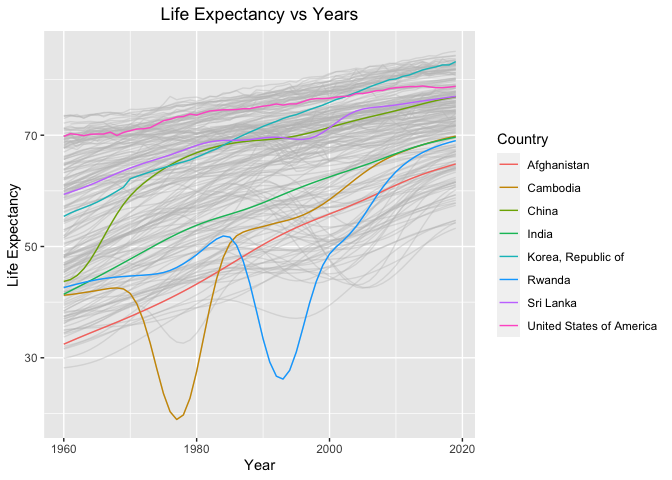
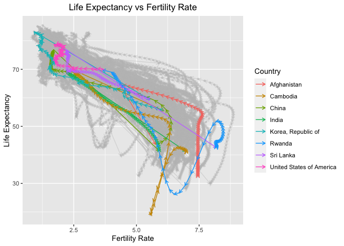
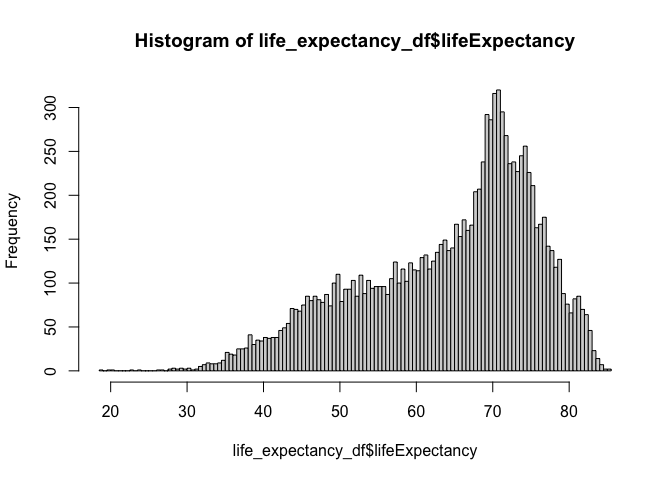
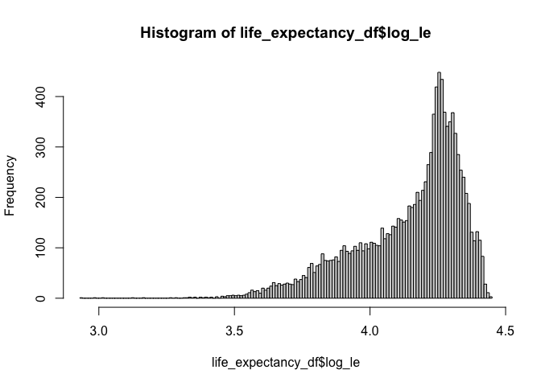

Life Expectancy Analysis
================
2024-05-14

``` r
# Load standard libraries
library("tidyverse")
```

# Question 1

## Question 1.1

1.  Life expectancy at birth refers to the number of years a newborn
    infant would live (or is expected to live) given that the existing
    mortality rates at the time of the birth remain the same throughout
    infant’s life. In the case of period life expectancy, we assume
    constant mortality rates into the future.

2.  Done below. We renamed column ‘time’ to year. Removed the NA entries
    in lifeExpectancy and year columns (we found 1325 NAs in
    lifeExpectancy, 36 NAs in year, and none in name). Moreover, on
    inspection, we find some empty strings in name, iso2, and region
    columns. We will replace any empty strings (““) with NA and then
    remove them from our analysis data set. After data cleaning, we get
    11618 ‘good’ observations.

``` r
life_expectancy_df <- read.csv("gapminder.csv", sep="\t")
```

``` r
life_expectancy_df <- life_expectancy_df %>% rename(year = time) #renamed column name time to year
```

``` r
sapply(life_expectancy_df, class)
```

    ##                iso3                name                iso2              region 
    ##         "character"         "character"         "character"         "character" 
    ##          sub.region intermediate.region                year     totalPopulation 
    ##         "character"         "character"           "integer"           "integer" 
    ##       fertilityRate      lifeExpectancy      childMortality youthFemaleLiteracy 
    ##           "numeric"           "numeric"           "numeric"           "numeric" 
    ##   youthMaleLiteracy       adultLiteracy              GDP_PC   accessElectricity 
    ##           "numeric"           "numeric"           "numeric"           "numeric" 
    ##    agriculturalLand agricultureTractors    cerealProduction        fertilizerHa 
    ##           "numeric"           "integer"           "integer"           "numeric" 
    ##                 co2     greenhouseGases              co2_PC            pm2.5_35 
    ##           "numeric"           "numeric"           "numeric"           "numeric" 
    ##        battleDeaths 
    ##           "integer"

``` r
nrow(life_expectancy_df) 
```

    ## [1] 13055

``` r
ncol(life_expectancy_df)
```

    ## [1] 25

``` r
sum(is.na(life_expectancy_df$lifeExpectancy))
```

    ## [1] 1325

``` r
sum(is.na(life_expectancy_df$year))
```

    ## [1] 36

``` r
sum(is.na(life_expectancy_df$name))
```

    ## [1] 0

``` r
life_expectancy_df <- life_expectancy_df %>% drop_na(lifeExpectancy)
life_expectancy_df <- life_expectancy_df %>% drop_na(year)
```

As seen below using the function summary, values in our dataset look
reasonable.

``` r
summary(life_expectancy_df$lifeExpectancy)
```

    ##    Min. 1st Qu.  Median    Mean 3rd Qu.    Max. 
    ##   18.91   56.44   67.44   64.30   72.92   85.42

``` r
summary(life_expectancy_df$year)
```

    ##    Min. 1st Qu.  Median    Mean 3rd Qu.    Max. 
    ##    1960    1975    1990    1990    2005    2019

``` r
life_expectancy_df[life_expectancy_df == ""] <- NA 
life_expectancy_df <- life_expectancy_df %>% drop_na(name)
```

3a. 204 countries.

``` r
countries <- unique(life_expectancy_df$name)
length(countries)
```

    ## [1] 204

3b. first year is 1960 and last or latest year is 2019.

``` r
min(life_expectancy_df$year)
```

    ## [1] 1960

``` r
max(life_expectancy_df$year)
```

    ## [1] 2019

3c. Lowest life expectancy is 18.907 yrs. It was recorded in Cambodia in
1977. Highest recorded life expectancy is 85.42 yrs for San Marino in
Europe in the year 2012.

3d. The Cambodian Genocide in the late 1970s was responsible for mass
violence and the resultant low life expectancy. It is estimated that
about 1.5 to 3 million people were killed by Khmer Rouge, a communist
political group.

``` r
life_expectancy_df %>% filter(lifeExpectancy == min(lifeExpectancy))
```

    ##   iso3     name iso2 region         sub.region intermediate.region year
    ## 1  KHM Cambodia   KH   Asia South-eastern Asia                <NA> 1977
    ##   totalPopulation fertilityRate lifeExpectancy childMortality
    ## 1         7196042         5.557         18.907          260.2
    ##   youthFemaleLiteracy youthMaleLiteracy adultLiteracy GDP_PC accessElectricity
    ## 1                  NA                NA            NA     NA                NA
    ##   agriculturalLand agricultureTractors cerealProduction fertilizerHa   co2
    ## 1            25500                1233          1080000           NA 73.34
    ##   greenhouseGases  co2_PC pm2.5_35 battleDeaths
    ## 1        11996.91 0.01019       NA           NA

``` r
life_expectancy_df %>% filter(lifeExpectancy == max(lifeExpectancy))
```

    ##   iso3       name iso2 region      sub.region intermediate.region year
    ## 1  SMR San Marino   SM Europe Southern Europe                <NA> 2012
    ##   totalPopulation fertilityRate lifeExpectancy childMortality
    ## 1           32105          1.26       85.41707            2.4
    ##   youthFemaleLiteracy youthMaleLiteracy adultLiteracy   GDP_PC
    ## 1                  NA                NA            NA 49939.01
    ##   accessElectricity agriculturalLand agricultureTractors cerealProduction
    ## 1               100               10                  NA               NA
    ##   fertilizerHa co2 greenhouseGases co2_PC pm2.5_35 battleDeaths
    ## 1           NA  NA              NA     NA       NA           NA

4.  Shown below. We have selected Rwanda as it shows an interesting drop
    in the life expectancy in early 1990s. We have also selected
    Afghanistan and India as both these countries had lower than average
    life expectancy in 1960 but their consistent positive growth will be
    insightful to compare with that of developed and under-developed
    countries. Moreover, we select Srilanka and try to compare how
    neighbors India and Srilanka have performed knowing that Srilanka
    started higher than India in the 1960.

``` r
life_expectancy_df %>% group_by(name) %>% summarize(lowest = min(lifeExpectancy)) %>% arrange(lowest) %>% head()
```

    ## # A tibble: 6 × 2
    ##   name         lowest
    ##   <chr>         <dbl>
    ## 1 Cambodia       18.9
    ## 2 Rwanda         26.2
    ## 3 Mali           28.2
    ## 4 Yemen          29.9
    ## 5 Sierra Leone   31.6
    ## 6 South Sudan    31.7

``` r
#Rwanda sticks out and is selected
```

``` r
life_expectancy_df_selected <- life_expectancy_df %>% filter(name %in% c("United States of America", "Korea, Republic of", "Cambodia", "China", "Rwanda", "Afghanistan", "India", "Sri Lanka"))
```

``` r
ggplot()+
  geom_line(mapping = aes(x = year, y = lifeExpectancy, group=name), alpha=0.4, color = "gray", data=life_expectancy_df)+
  geom_line(mapping = aes(x = year, y = lifeExpectancy, group=name, color=name), data= life_expectancy_df_selected)+
  ggtitle("Life Expectancy vs Years")+
  xlab("Year")+
  ylab("Life Expectancy")+
  theme(plot.title = element_text(hjust = 0.5))+
  labs(color = "Country")
```

<!-- -->

5.  A very high level view tells us that life expectancy increases over
    our time range (1960-2019). However, the rate of growth is different
    for different countries, and a few countries in our selection and
    the overall dataset go through interesting peaks and troughs in this
    time range. Firstly, life expectancy in USA has changed by 12.93%
    from 69.77 to 78.79 yrs. This trend showcases a steady increase in
    the US life expectancy over the years. Cambodia, on the other hand,
    had the lowest life expectancy in 1977 and the huge golden trough
    showcases the same. However, it is interesting to note that Cambodia
    has mostly overcome the 1970s genocide and latest life expectancy is
    ~70 yrs. Rwanda’s life expectancy dropped in the early 1990s due to
    systemic massacres which were triggered after the deaths of
    Presidents of Rwanda and Burundi in a plane crash caused by a rocket
    attack.

China has taken giant leaps in life expectancy growth over the time
period. It records a staggering 75.91% increase from 1960-2019 owing to
robust healthcare development and administration by the government.
South Korea’s life expectancy has grown by 50.2% to ~83.23 yrs. There
are several interesting theories behind East Asia’s high life expectancy
numbers. One suggests that the food and dietary habits are excellent,
providing holistic nutrition.

**comparison of the Neighbors**: India started at a low life expectancy
of 41.42 yrs in 1960. Although the country has seen bouts of political
instability, such as the suspicious death of Prime Minister Lal Bahadur
Shastri in 1966 and the 1984 anti Sikh riots, life expectancy has
steadily climbed over the years owing to general stability and quick
damage control actions by the government agencies. From 1960-2019, India
registered a life expectancy growth of 68.18%. On the other hand,
Srilanka, a much smaller country in terms of GDP output and area, has
shown remarkable performance as it has a life expectancy growth rate of
29.66% with a 2019 life expectancy of 76.98 yrs! Ignoring the small
negative effect of Srilankan civil war from 1980-2000 (this affect is
visible in the visualization), Srilanka’s excellent healthcare and
immunization programs have been responsible for a very high life
expectancy.

6.  Done below.

``` r
#dropping NA entries in the fertility rate column
life_expectancy_df <- life_expectancy_df %>% drop_na(fertilityRate)
```

``` r
life_expectancy_df_selected <- life_expectancy_df %>% filter(name %in% c("United States of America", "Korea, Republic of", "Cambodia", "China", "Rwanda", "Afghanistan", "India", "Sri Lanka")) #updating selected data frame
```

``` r
#first plot is all countries in semi transparent gray
first_plot <- ggplot()+
  geom_point((mapping = aes (x=fertilityRate, y = lifeExpectancy, group=name)), color="gray", alpha = 0.4, size = 1, data=life_expectancy_df)

#using arrow option in geom segment to show trend. function 'lead' ensures arrows point towards the next data point 
first_plot +
  geom_segment(mapping = aes(x = fertilityRate, y = lifeExpectancy, xend = lead(fertilityRate), yend = lead(lifeExpectancy), group=name), color = "gray", alpha=0.4, arrow=arrow(length = unit(0.07, "inches")), data=life_expectancy_df) + 
  geom_segment(mapping = aes(x = fertilityRate, y = lifeExpectancy, xend = lead(fertilityRate), yend = lead(lifeExpectancy), group=name, color=name), arrow=arrow(length = unit(0.07, "inches")), data=life_expectancy_df_selected)+
  ggtitle("Life Expectancy vs Fertility Rate")+
  xlab("Fertility Rate")+
  ylab("Life Expectancy")+
  theme(plot.title = element_text(hjust = 0.5))+
  labs(color = "Country")
```

<!-- -->

7.  A high level observation is that world is going towards decreasing
    fertility rate with an increasing life expectancy. This result is
    also in sync with the expectation that as countries develop and
    prosper over time, healthcare infrastructure improves, in-turn
    resulting in higher awareness around family planning. In other
    words, ‘quality’ gets precedence over ‘quantity’. For US, China,
    South Korea and Cambodia, fertility rates have decreased over
    1960-2019. The most noticeable downward trend seems to be in China
    and Korea wherein the fertility rate has decreased from around 6 to
    ~0.92 for Korea and ~1.7 for China. US has had a 53% drop in
    fertility rate from 3.65 in 1960 to 1.7 in 2019.

In India, the fertility rate has dropped to ~2.2 in 2019 from around 5.9
yet the decrease is not as sharp as some of the other East Asian nations
such as South Korea or China. Interestingly, Afghanistan had a high
fertility rate of 7.45 in 1960 and while it has gone down, it still is
around ~4.32, indicating that the country is currently evolving and
working on healthcare accessibility and awareness campaigns.

All in all, it’s not just socioeconomic factors such as economic
development and healthcare accessibility but also reasons such as women
empowerment and changing cultural norms which are responsible for an
inverse relationship between fertility rate and life expectancy.

## Question 1.2

1.  The distribution of life expectancy is a left-skewed distribution.
    In order to test if it is log normal, we do a log transformation and
    don’t get a normal distribution, meaning it is not log normal and
    hence a log transformation is not helpful. We will proceed as is
    without any transformation.

``` r
hist(life_expectancy_df$lifeExpectancy, breaks=150)
```

<!-- -->

``` r
life_expectancy_df$log_le <- log(life_expectancy_df$lifeExpectancy)
hist(life_expectancy_df$log_le, breaks=150)
```

<!-- -->

``` r
life_expectancy_df <- life_expectancy_df %>% mutate(log_le = NULL) #deleting the log transformed column
```

2.  Done below.

``` r
life_expectancy_df$yearminus2k <- life_expectancy_df$year - 2000
```

``` r
linear_m <- lm(lifeExpectancy ~ yearminus2k, data = life_expectancy_df)
summary(linear_m)
```

    ## 
    ## Call:
    ## lm(formula = lifeExpectancy ~ yearminus2k, data = life_expectancy_df)
    ## 
    ## Residuals:
    ##     Min      1Q  Median      3Q     Max 
    ## -41.326  -7.616   2.494   8.045  18.568 
    ## 
    ## Coefficients:
    ##              Estimate Std. Error t value Pr(>|t|)    
    ## (Intercept) 67.337495   0.109411   615.5   <2e-16 ***
    ## yearminus2k  0.308893   0.005448    56.7   <2e-16 ***
    ## ---
    ## Signif. codes:  0 '***' 0.001 '**' 0.01 '*' 0.05 '.' 0.1 ' ' 1
    ## 
    ## Residual standard error: 10.15 on 11584 degrees of freedom
    ## Multiple R-squared:  0.2172, Adjusted R-squared:  0.2172 
    ## F-statistic:  3215 on 1 and 11584 DF,  p-value: < 2.2e-16

3.  year - 2000 makes sense because it will help us reasonably
    understand the meaning behind intercept estimate. With a y - 2000
    transformation, we can say that the intercept estimate is life
    expectancy for the year 2000 because (year - 2000) is zero when year
    is 2000. The transformation standardizes the time scale and now has
    a meaningful central point of year = 2000. If we do not do the
    transformation, we are left to make sense out of year = 0, which
    doesn’t have any intuitive meaning.

4.  B0 (67.34 yrs) is the life expectancy for the year 2000. B1 is
    ~0.309. It refers to the change in life expectancy when we add 1
    year. Life expectancy increases by 0.309 yrs over every year.
    Results are statistically significant as p value is \<2e-16.

``` r
sum(is.na(life_expectancy_df$region)) #shows no missing values in region
```

    ## [1] 0

``` r
unique(life_expectancy_df$region) #result shows we have 5 regions overall
```

    ## [1] "Americas" "Asia"     "Africa"   "Europe"   "Oceania"

5.  Done below.

``` r
multiple_m <- lm(lifeExpectancy ~ yearminus2k + region, data = life_expectancy_df)
summary(multiple_m)
```

    ## 
    ## Call:
    ## lm(formula = lifeExpectancy ~ yearminus2k + region, data = life_expectancy_df)
    ## 
    ## Residuals:
    ##     Min      1Q  Median      3Q     Max 
    ## -42.169  -4.057   0.568   4.047  18.947 
    ## 
    ## Coefficients:
    ##                 Estimate Std. Error t value Pr(>|t|)    
    ## (Intercept)    55.867434   0.122967  454.33   <2e-16 ***
    ## yearminus2k     0.304986   0.003566   85.53   <2e-16 ***
    ## regionAmericas 15.932826   0.182133   87.48   <2e-16 ***
    ## regionAsia     12.223541   0.169177   72.25   <2e-16 ***
    ## regionEurope   20.899936   0.180178  116.00   <2e-16 ***
    ## regionOceania  13.652706   0.264300   51.66   <2e-16 ***
    ## ---
    ## Signif. codes:  0 '***' 0.001 '**' 0.01 '*' 0.05 '.' 0.1 ' ' 1
    ## 
    ## Residual standard error: 6.64 on 11580 degrees of freedom
    ## Multiple R-squared:  0.6648, Adjusted R-squared:  0.6647 
    ## F-statistic:  4594 on 5 and 11580 DF,  p-value: < 2.2e-16

6.  Africa is the reference category. Intercept estimate is 55.87 yrs,
    which is the life expectancy for the year 2000 and region Africa.
    The life expectancy for America is 55.87 + 15.93 = 71.8 yrs, keeping
    the year same. Likewise, Asia’s life expectancy is 12.22 yrs more
    than that of Africa. Oceania’s is 13.65 yrs more than the reference
    category’s or Africa’s. Europe has the highest life expectancy,
    which is ~20.9 yrs more than Africa’s. For all these comparison
    statement, year or time is kept the same. All results are
    statistically significant since p value is very low (\<2e-16).

Lastly, if we increase year by 1 without changing other variables, life
expectancy increases by ~0.305 yrs. Result is statistically significant
since p value is \<2e-16 (very low!). Magnitude is slightly smaller than
what we previously saw.

``` r
life_expectancy_df <- life_expectancy_df %>% drop_na(GDP_PC) #dropping NA entries
life_expectancy_df$log_GDPPC <- log(life_expectancy_df$GDP_PC)
```

7.  Shown below.

``` r
multiple_m_v2 <- lm(lifeExpectancy ~ yearminus2k + region + log_GDPPC + fertilityRate, data = life_expectancy_df)
summary(multiple_m_v2)
```

    ## 
    ## Call:
    ## lm(formula = lifeExpectancy ~ yearminus2k + region + log_GDPPC + 
    ##     fertilityRate, data = life_expectancy_df)
    ## 
    ## Residuals:
    ##     Min      1Q  Median      3Q     Max 
    ## -23.292  -2.477   0.289   2.724  12.250 
    ## 
    ## Coefficients:
    ##                Estimate Std. Error t value Pr(>|t|)    
    ## (Intercept)    49.93572    0.50900   98.11   <2e-16 ***
    ## yearminus2k     0.13778    0.00355   38.81   <2e-16 ***
    ## regionAmericas  6.03430    0.15968   37.79   <2e-16 ***
    ## regionAsia      5.84118    0.15009   38.92   <2e-16 ***
    ## regionEurope    5.42126    0.20713   26.17   <2e-16 ***
    ## regionOceania   5.75319    0.22491   25.58   <2e-16 ***
    ## log_GDPPC       2.49027    0.04699   53.00   <2e-16 ***
    ## fertilityRate  -2.23512    0.04635  -48.23   <2e-16 ***
    ## ---
    ## Signif. codes:  0 '***' 0.001 '**' 0.01 '*' 0.05 '.' 0.1 ' ' 1
    ## 
    ## Residual standard error: 4.345 on 8970 degrees of freedom
    ## Multiple R-squared:  0.8472, Adjusted R-squared:  0.8471 
    ## F-statistic:  7107 on 7 and 8970 DF,  p-value: < 2.2e-16

8.  The log_GDPPC estimate is 2.49, which tells us that life expectancy
    increases by 2.49 yrs when we increase log of GDP per capita by 1
    unit. Also, as the fertility rate increases by 1 unit, life
    expectancy decreases by 2.23 yrs. It is key to note that we’re
    assuming other variables stay the same. All results are
    statistically significant.

9.  America is now leading the pack with a dummy estimate of 6.034.
    Europe’s estimate is 4th largest - 5.42. Earlier, we modeled life
    expectancy on time and region and now we are trying to understand
    how log GDP per capita and fertility rate along with the other two
    explanatory variables affect life expectancy. Now there is an
    interplay of several more variables in our model, and we are
    interested in understanding the cumulative affect of all these
    variables on our outcome variable, life expectancy. Our new model
    adjusts Beta values according to all the explanatory variables and
    hence the rankings change.

``` r
life_expectancy_df %>% group_by(region) %>% summarize(avg_life_expectancy=mean(lifeExpectancy)) #checking average life expectancy
```

    ## # A tibble: 5 × 2
    ##   region   avg_life_expectancy
    ##   <chr>                  <dbl>
    ## 1 Africa                  53.8
    ## 2 Americas                68.7
    ## 3 Asia                    67.5
    ## 4 Europe                  75.2
    ## 5 Oceania                 67.4

10. Basis our final model which gave statistically significant results,
    we can say America has the highest life expectancy. Our final model
    which says America has the highest life expectancy has a R square of
    0.847, best among all our models. However, as per group averages
    Europe leads the pack and Europe also comes out on the top when we
    modeled life expectancy on only year and region. Africa is certainly
    the lowest and the result is confirmed in every model.
